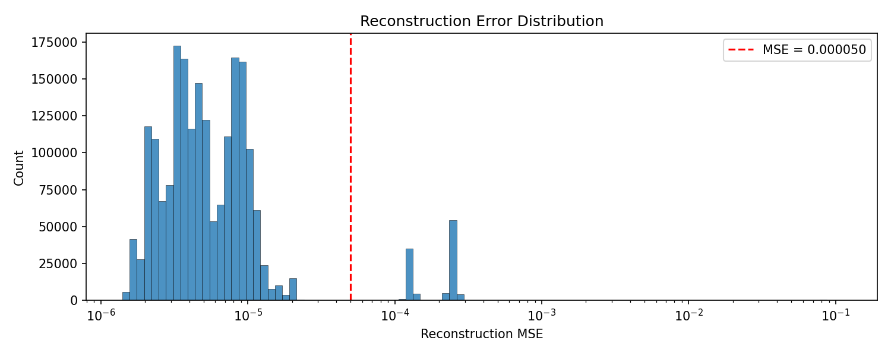
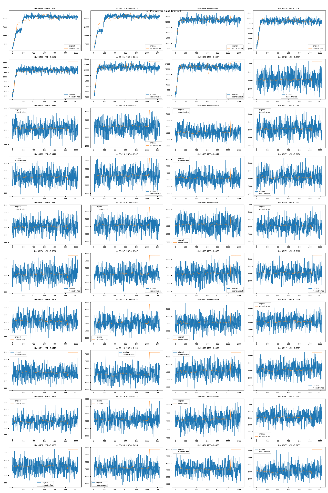

# pulse-autoencoder

Unsupervised RF pulse anomaly detection for CERN LINAC4 using a convolutional autoencoder. The model learns to reconstruct normal RF voltage pulses and flags anomalies (voltage breakdowns) by thresholding the reconstruction error.

> **Note:** The trained model weights have been purposefully excluded from the repo. Feel free to ask me for a demonstration.

## Overview

RF cavities produce voltage pulses that are predominantly normal, but occasionally exhibit voltage breakdowns. Since labeled data is scarce, this project takes an unsupervised approach: a 1D convolutional autoencoder is trained on unlabeled pulse data (mostly normal), and pulses with high reconstruction error are classified as anomalous.

The pipeline covers the full workflow from raw data ingestion through training, evaluation, inference, and ONNX export for deployment.

## Architecture

`PulseAutoEncoder` is a symmetric Conv1d encoder-decoder operating on 4096-sample signals:

```
Input (1, 4096)
  │
  ├── Encoder
  │     Conv1d(1→8, k=7, s=4) → ReLU
  │     Conv1d(8→16, k=5, s=4) → ReLU
  │     Conv1d(16→8, k=5, s=4) → ReLU
  │     AdaptiveAvgPool1d(2)
  │     → Latent (8, 2)
  │
  ├── Decoder
  │     ConvTranspose1d(8→16, k=5, s=4) → ReLU
  │     ConvTranspose1d(16→8, k=5, s=4) → ReLU
  │     ConvTranspose1d(8→1, k=7, s=4)
  │     → Interpolate to 4096
  │
Output (1, 4096)
```

Anomaly detection threshold: MSE > 0.00005

## Repository Structure

```
pulse-autoencoder/
├── pyproject.toml
├── README.md
├── plots/                                  # Example output plots
├── docs/source/                            # Sphinx documentation
├── tests/
│   └── test_placeholder.py
└── pulse_autoencoder/
    ├── __init__.py
    ├── _version.py
    ├── executable.sh                       # HTCondor entrypoint
    ├── submit.sub                          # HTCondor submit file
    ├── autoencoder/
    │   ├── model/
    │   │   └── autoencoder_model.py        # PulseAutoEncoder definition
    │   └── pipeline/
    │       ├── training.py                 # Train and evaluate the model
    │       ├── predict.py                  # Classify pulses as good/bad
    │       ├── compile_with_onnx.py        # Export model to ONNX
    │       └── time_model.py              # Benchmark inference latency
    └── manipulate_data/
        ├── load_data.py                    # Dataset loading and preparation
        └── inpect_classified_df.py         # Visualize classified pulses
```

## Installation

Requires Python ≥ 3.11.

```bash
git clone https://github.com/ng-ngallou/pulse-autoencoder.git
cd pulse-autoencoder
pip install -e .
```

For development (linting, type checking, pre-commit hooks):

```bash
pip install -e ".[dev,test,doc]"
```

## Usage

### Prepare data

Combine raw pickle files from a data directory into a single mixed dataset:

```bash
python -m pulse_autoencoder.manipulate_data.load_data --data-dir ./data --output ./data/mixed/mixed_df.pkl
```

### Train the autoencoder

```bash
train_autoencoder --data ./data/mixed/mixed_df.pkl
```

Or equivalently:

```bash
python -m pulse_autoencoder.autoencoder.pipeline.training --data ./data/mixed/mixed_df.pkl
```

### Classify pulses

```bash
python -m pulse_autoencoder.autoencoder.pipeline.predict \
    --data ./data/mixed/mixed_df.pkl \
    --model ./pulse_autoencoder/autoencoder/model/mixed_data_autoencoder.pth
```

This produces a labeled DataFrame and an error distribution plot.

### Inspect results

```bash
python -m pulse_autoencoder.manipulate_data.inpect_classified_df \
    --data ./data/df_classified_mixed_pulses.pkl \
    --n 40 --sort-by-error
```

### Export to ONNX

```bash
python -m pulse_autoencoder.autoencoder.pipeline.compile_with_onnx \
    --model ./pulse_autoencoder/autoencoder/model/mixed_data_autoencoder.pth \
    --output ./pulse_autoencoder/autoencoder/model/pulse_autoencoder.onnx
```

### Benchmark inference

```bash
python -m pulse_autoencoder.autoencoder.pipeline.time_model \
    --data ./data/mixed/mixed_df.pkl \
    --model ./pulse_autoencoder/autoencoder/model/mixed_data_autoencoder.pth
```

### HTCondor submission

For batch training on CERN's HTCondor cluster:

```bash
condor_submit pulse_autoencoder/submit.sub
```

## Example Outputs

| Error Distribution | Reconstructed Bad Pulses |
|---|---|
|  |  |

## Dependencies

- **torch** — model definition, training, inference
- **numpy**, **pandas** — data handling
- **scikit-learn** — train/test splitting
- **scipy** — signal resampling (interpolation)
- **matplotlib** — visualization
- **onnx**, **onnxruntime** — ONNX export and validation (optional)

